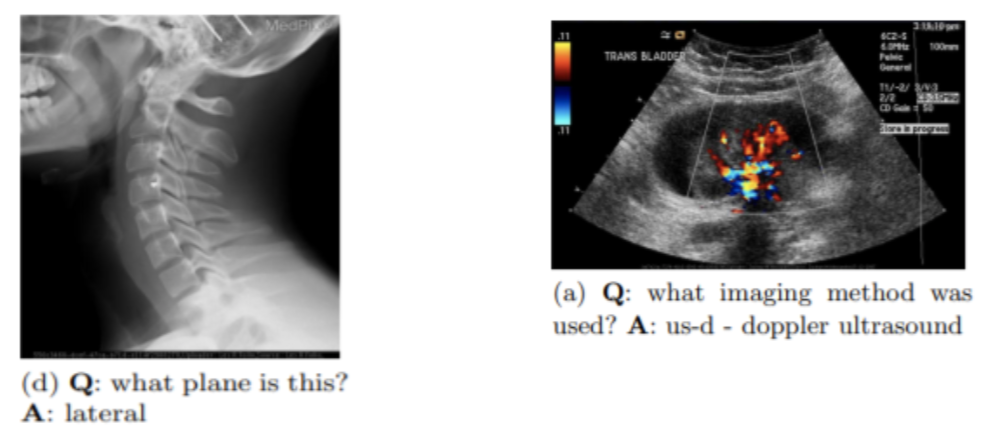
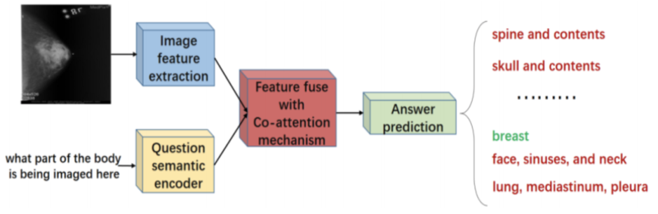

# Democratizing Medical Diagnosis: A Visual Question Answering (VQA) based Approach

This repository is part of an on-going research in the domain of Medical Visual Question Answering (Med-VQA) systems. As part of our research, we hope to build upon the contributions of [this paper](http://ceur-ws.org/Vol-2380/paper_85.pdf) which is currently the state-of-the-art in the domain of MedVQA based upon the [ImageCLEF 2019 dataset](https://github.com/abachaa/VQA-Med-2019).

# Problem

Current Diagnostic Decision Support Systems (DDSS) do not take into context both - **clinical images** as well as the **natural language questions** of the clinicians.

Clinicians often wish to ask questions specific to a clinical image and expect an answer in return based on the properties exhibited by the image (X-Ray, CT Scans, etc.).

- “what is the organ principally shown in this angiogram?”
- “what abnormality is seen in the image?”
- “in what plane is this x-ray?”

These are just some example instances wherein the clinician will require a DDSS that can interpret both - the input image as well as the clinician's questions in order to produce an answer.

# Proposed Solution

Our team proposes a **Diagnostic Decision Support System (DDSS)** which takes as input a clinical image and a natural-language question about the image, and produces a natural language answer as the output.

This DDSS employs a **Visual Question Answering (VQA)** system which works at intersection of computer vision and natural-language processing techniques.

A system of this caliber would be able to assist clinicians and the general public in answering their complicated image-oriented queries.

    

# Dataset

We use the ImageCLEF 2019 dataset. A comprehensive analysis of this dataset was done and presented [here](https://github.com/yashjaiswal1/Med-VQA/blob/main/data_exploration.ipynb).

# System Design

The proposed solution consists of 3 modules:

- Image Feature Extraction
- Question Semantic Encoder
- Feature fusion with co-attention mechanism

    

## Image Feature Extraction

We built a `VGG-16` network to extract the inherent features from the image data.  
An in-depth explanation of it's architecture and implementation is presented [here](https://github.com/yashjaiswal1/Med-VQA/blob/main/VGG_16_implementation.ipynb).

## Question Semantic Encoder

We employed the `base BERT` model to extract the semantic features from the input question.  
An in-depth explanation of it's architecture and implementation is presented [here](https://github.com/yashjaiswal1/Med-VQA/blob/main/BERT_implementation.ipynb).

## Feature fusion with co-attention mechanism

We plan to fuse the features obtained from the previous two modules using `Multi-modal Factorized Bilinear pooling (MFB)` with co-attention.  
This module is part of our on-going effort and we'll be updating our work here as we make progress.

# Contributors

See [CONTRIBUTORS.md](CONTRIBUTORS.md).
